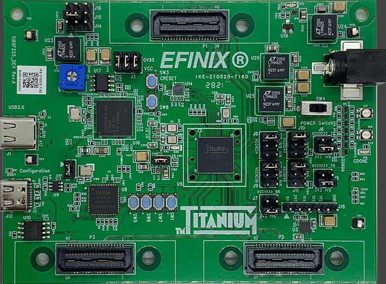

.. _titanium_ti60_f225:

Efinix Titanium Ti60 F225
#########################

Overview
********

The titanium_ti60_f225 is a FPGA development board. Efinix provides Sapphire SoC IP, 
The Sapphire SoC is a RISC-V user-configurable, high-performance SoC. 
Using the Efinity IP Manager, you can configure the SoC to include only the peripherals that you require.

Figure is the development board

Board block diagram 
*******************

More information can be found on `Ti60F225`_ website.

Sapphire SoC setup on the FPGA guide
*************************************

Guide to setup the SoC found at `Efinix-Zephyr`_

Building
********

Build applications as usual (see :ref:`build_an_application` and
:ref:`application_run` for more details).

.. zephyr-app-commands::
   :zephyr-app: samples/hello_world
   :board: titanium_ti60_f225
   :goals: build

Flashing
********

Flashing the binnary into SPI requires Efinity programmer, Please find the guide at `Efinix-Zephyr`_

References
**********

.. target-notes::

.. _Ti60F225: https://www.efinixinc.com/products-devkits-titaniumti60f225.html
.. _Efinix-Zephyr: https://github.com/Efinix-Inc/zephyr-efinix